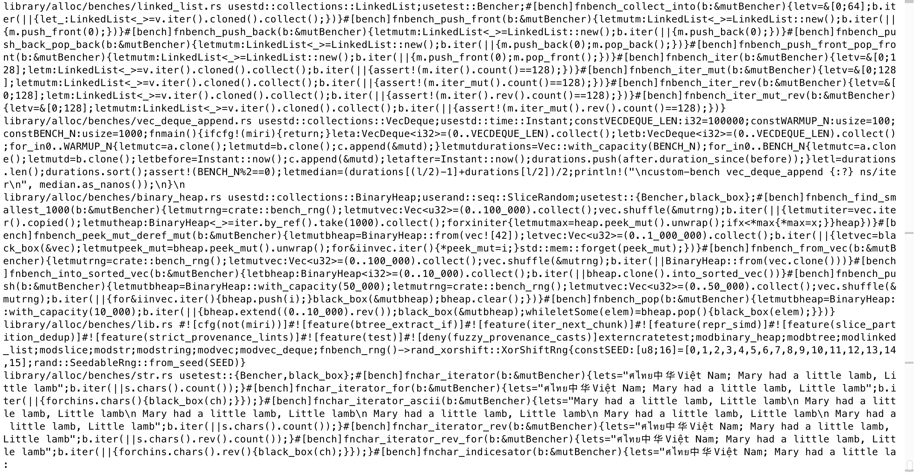

# rust-spitter

rust-spitter will look at a Rust codebase and spit out each .rs file on a single line prepended by the filename.

This is useful for creating code blocks that can be used in graphics, art, or whatever other purpose you want.

